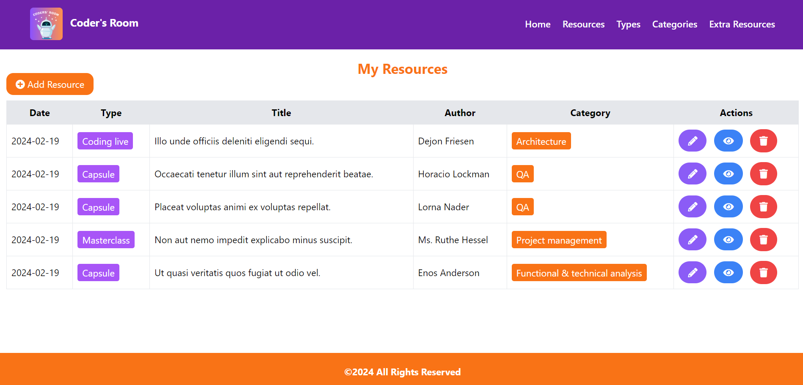

# Coders-Room

## PEDAGOGICAL OBJECTIVE  
To be introduced to full stack web development using PHP with Laravel and MySQL. The project allows the application of concepts such as form handling, database queries, data validation and information manipulation.

## CONTEXT / NEED
This is a functional web application of a resource manager, where users can add, edit and delete resources. The application allows users to manage their resources efficiently, keeping an organised record.

## Final Result
  

## Process 
### Tecnologies
For this project we have used :

 

## Installation Steps
1.  Download and Install Node.js: Visit the official[website](https://nodejs.org/en) and download the version compatible with your operating system. Follow the installation instructions provided on the website.

2. Download and Install XAMPP: Visit the official XAMPP [website](https://www.apachefriends.org/index.html) and download the version compatible with your operating system (Windows, macOS or Linux). Follow the installation instructions provided on the website.

3. Download and Install Composer: Visit the official [web](https://getcomposer.org/) and download the version compatible with your operating system. Follow the installation instructions provided on the website.

4. Start XAMPP and Apache: After installing XAMPP, start the application. Start the Apache server from the XAMPP control panel.

5. You can use a compatible database (e.g. MySQL, PostgreSQL), in our case MySQL is used. Open PHPMyAdmin in your web browser and create the database you are going to work with, for example : 
- Click on "SQL" in the top navigation bar.
- In the SQL query window, paste the provided SQL code:

```sql
CREATE DATABASE coders_room; 
```

6. [Clone](https://docs.github.com/es/repositories/creating-and-managing-repositories/cloning-a-repository) the repository.

7. Place the project in the htdocs folder: 
- In XAMPP, the home directory of the web server is htdocs. Place the project in this directory. 

8. Open the project in Visual Studio Code (a source code editor developed by Microsoft for Windows, Linux, macOS and Web).

9. Open the project terminal in Visual Studio Code and run `composer install` and `npm install`.

10. Then copy the Configuration File with the following command `cp .env.example . env`. Configure your file . env with details of your environment, such as the connection to the database. 

11. Then you must generate the Application Key with the following command `php artisan key:generate`.

12. Then run Migrations and Seeds with the following command `php artisan migrate --seed`. This will configure the database structure, create the necessary tables and populate them with the test data that was preset in the project.

13. Start Development Server : Run the following command `php artisan serve`. The application will be available in http://localhost:8000 (or on the port specified by the console).

14. In another terminal you must Compile Assets with the command `npm run dev`. This command will compile the assets and place them in the appropriate folder for use in the application. 

15. Access to the App: Open your browser and visit http://localhost:8000. You should see your application running.

16. Access your project in the browser: Open your web browser and visit the project path with localhost first, e.g.: http://localhost/P8_ToDo_List/

17. Enjoy it.


## Authors
created with 💜 by:
- [NathaliaRuiz](https://github.com/NathaRuiz)
- [MariaGarcia](https://github.com/MariaGarciaJordan)
- [HelenaDR84](https://github.com/HelenaDR84)
- [Kalypso89](https://github.com/Kalypso89)
